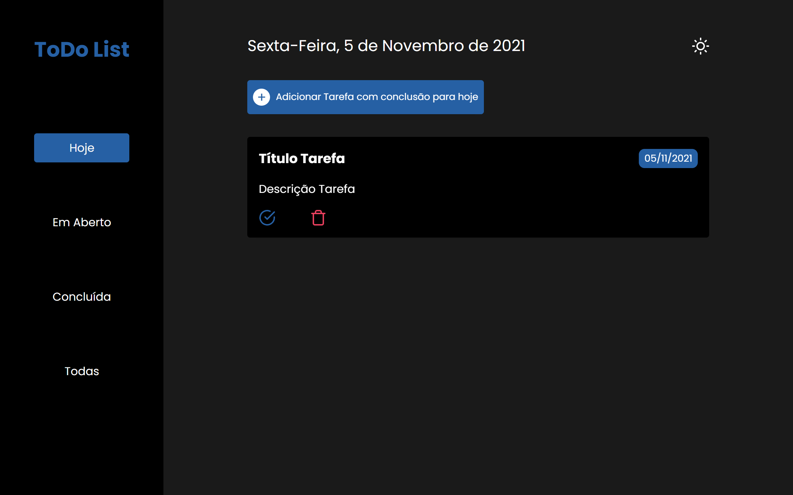
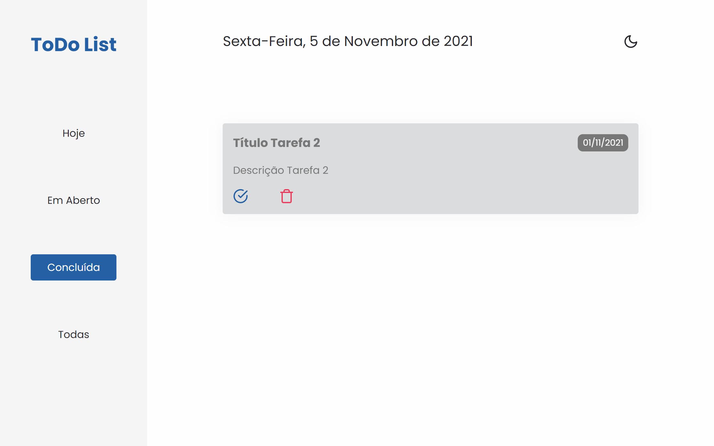

# ToDo List 

<p align="center">
  <a href="#o-projeto">Projeto</a>&nbsp;&nbsp;&nbsp;|&nbsp;&nbsp;&nbsp;
  <a href="#tecnologias">Tecnologias</a>&nbsp;&nbsp;&nbsp;|&nbsp;&nbsp;&nbsp;
  <a href="#behavior">Behavior</a>&nbsp;&nbsp;&nbsp;|&nbsp;&nbsp;&nbsp;
  <a href="#behavior">Páginas</a>&nbsp;&nbsp;&nbsp;|&nbsp;&nbsp;&nbsp;
  <a href="#executando-o-projeto">Executar</a>
</p>

## O Projeto
ToDo List é um projeto de gerenciamento de tarefas. Nele é possível visualizar as tarefas com vencimento no dia atual, as tarefas em aberto e as concluidas. É possível cadastrar e excluir tarefas, assim como marcar e desmarcar como concluida. Além disso, é possível escolher o tema a ser usado. É um projeto responsivo, sendo adaptável em smartphones, tablets e notebook.

## Tecnologias

Esse projeto foi desenvolvido com as seguintes tecnologias:

- HTML
- CSS com SCSS
- JavaScript

## Behavior
### Dark Theme


### Light Theme


### Páginas - Dark Theme
Hoje


Em aberto


Concluidas


Todas


Modal de Cadastro


### Páginas - Light Theme
Hoje


Em aberto


Concluidas


Todas


Modal de Cadastro


## Executando o projeto

```bash
# Clone este repositório
$ git clone https://github.com/LeandroFilie/ToDo-List.git

# Acesse a pasta do projeto no seu terminal/cmd
$ cd ToDo-List
```
Para acesso de forma online, acesse: [to-do-list-leandrofilie.vercel.app/](to-do-list-leandrofilie.vercel.app)

---

Feito com :heart: by [Leandro Filié](https://github.com/LeandroFilie)

